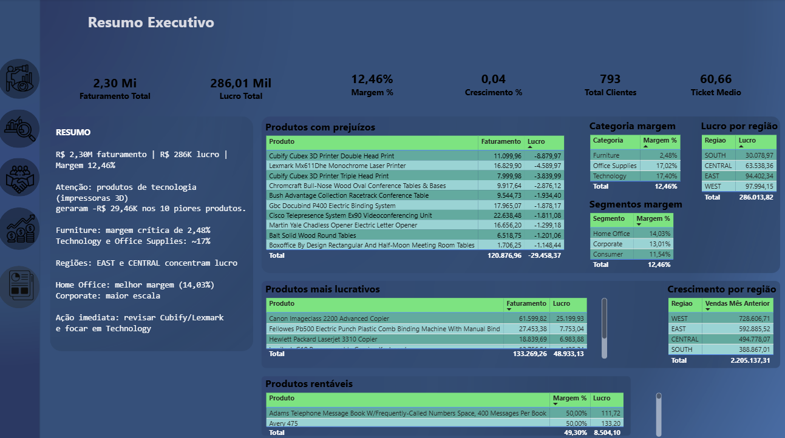
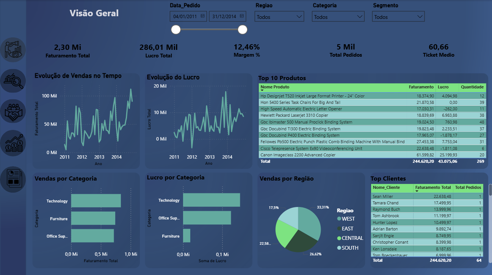
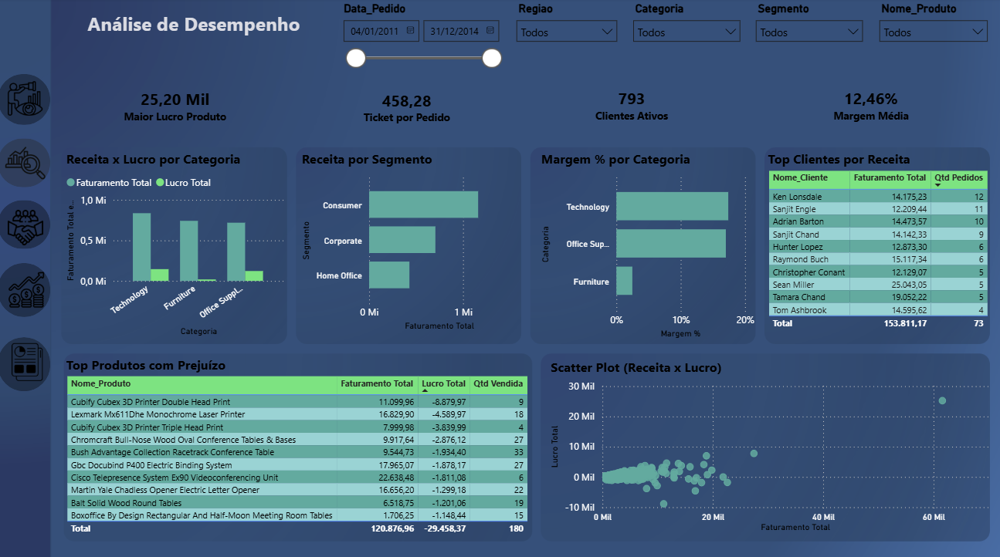
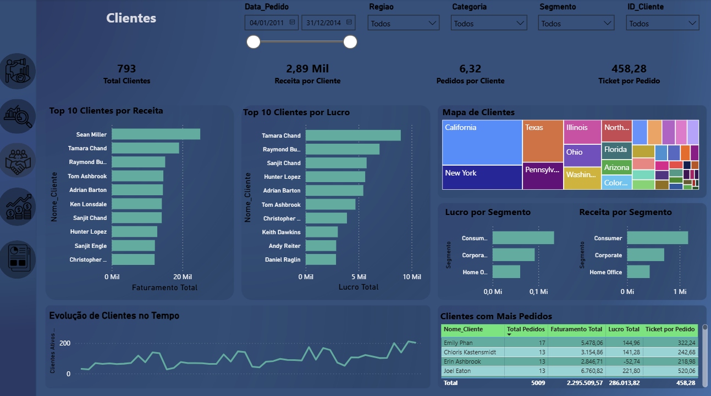
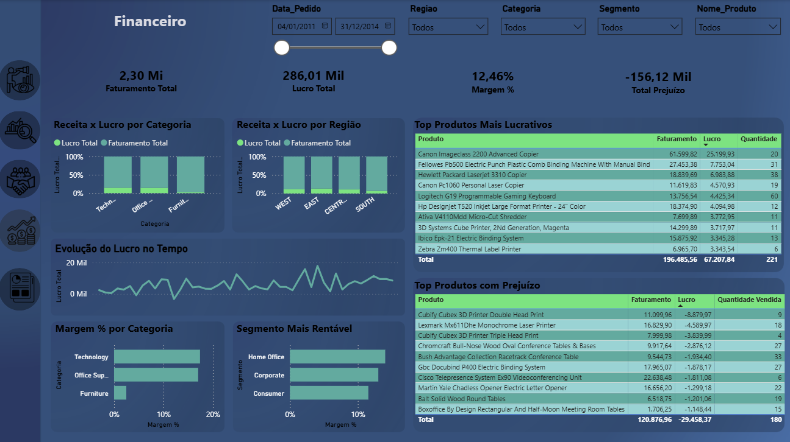
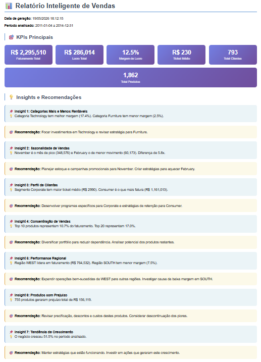
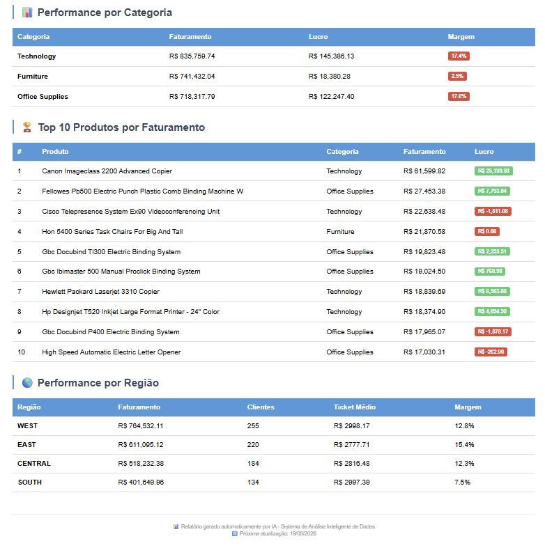

Retail Sales Analytics & Intelligent AI Analysis System
📌 Sobre o Projeto

Projeto completo de Engenharia de Dados, Business Intelligence e Análise Inteligente desenvolvido com foco em tomada de decisão estratégica.

O sistema foi construído simulando um ambiente corporativo real, integrando:

Pipeline ETL automatizado
Modelagem dimensional (Star Schema)
Banco de dados MySQL
Dashboards executivos em Power BI
Sistema Inteligente de Análise de Dados com IA
Geração automatizada de insights e recomendações estratégicas

O objetivo do projeto é transformar dados brutos de vendas em informações estratégicas para negócio, permitindo análises executivas, financeiras, comerciais e operacionais.

🚀 Arquitetura Completa do Projeto
┌─────────────────────────────────────────────────────────────────────────────┐
│                    RETAIL SALES ANALYTICS SYSTEM                           │
├─────────────────────────────────────────────────────────────────────────────┤
│                                                                             │
│  📁 Fonte de Dados        🐍 ETL Python         🗄️ Banco de Dados           │
│  ┌──────────────┐        ┌──────────────┐      ┌──────────────┐            │
│  │ Superstore   │ ─────► │ ETL Pipeline │ ───► │    MySQL     │            │
│  │ CSV Dataset  │        │   Pandas     │      │ Star Schema  │            │
│  └──────────────┘        └──────────────┘      └──────────────┘            │
│                                      │                   │                  │
│                                      ▼                   ▼                  │
│                           ┌────────────────┐  ┌────────────────────┐       │
│                           │ Power BI       │  │ Sistema Inteligente │       │
│                           │ Dashboards     │  │ de Análise IA       │       │
│                           └────────────────┘  └────────────────────┘       │
│                                                                             │
└─────────────────────────────────────────────────────────────────────────────┘
🧠 Tecnologias Utilizadas
🐍 Python

Responsável por todo o pipeline ETL e sistema de análise inteligente.

Bibliotecas utilizadas:

pandas
numpy
sqlalchemy
pymysql
plotly
openpyxl
🗄️ MySQL

Banco de dados relacional utilizado para armazenamento estruturado dos dados em modelo dimensional.

📊 Power BI

Ferramenta utilizada para construção dos dashboards executivos e analíticos.

Recursos utilizados:

DAX
KPIs
Modelagem relacional
Storytelling executivo
Visualizações estratégicas
📈 Plotly

Utilizado na geração de dashboards HTML interativos do sistema inteligente de análise.

⚙️ Pipeline ETL

O processo ETL foi desenvolvido em Python seguindo arquitetura profissional de dados.

🔹 Extract (Extração)

Leitura do dataset CSV contendo:

vendas
clientes
produtos
regiões
segmentos
lucro
descontos
datas
🔹 Transform (Transformação)

Processos realizados:

tratamento de valores nulos
padronização de colunas
tradução de campos
conversão de datas
criação de métricas auxiliares
enriquecimento de dados
criação de dimensões analíticas
🔹 Load (Carga)

Os dados tratados são carregados automaticamente no MySQL utilizando SQLAlchemy.

🧱 Modelagem de Dados (Star Schema)

O projeto foi estruturado utilizando modelagem dimensional profissional.

📄 Tabelas Dimensionais
dim_cliente
dim_produto
dim_data
dim_local
📄 Tabela Fato
fato_vendas
📂 Estrutura do Projeto
retail-sales-analytics/
│
├── config/
│   └── config.py
│
├── data/
│   └── Superstore.csv
│
├── src/
│   ├── etl_pipeline.py
│   ├── analise_inteligente.py
│   ├── monitor.py
│   └── scheduler.py
│
├── powerbi/
│   └── dashboard_vendas.pbix
│
├── relatorios_ia/
│   ├── relatorio_completo.html
│   └── resumo_executivo.csv
│
├── images/
│   ├── Resumo_Executivo.png
│   ├── Visão_Geral.png
│   ├── Analise_de_Desempenho.png
│   ├── Clientes.png
│   ├── Financeiro.png
│   ├── Relatório_ia.png
│   └── Performance_ia.png
│
├── run.py
├── requirements.txt
└── README.md
# 📊 Estrutura do Dashboard

O dashboard foi dividido em páginas estratégicas para permitir uma análise completa do negócio, cobrindo visão executiva, financeira, operacional e análise de clientes.

Cada página foi desenvolvida com foco em tomada de decisão, storytelling de dados e análise estratégica.

---

# 🧠 Resumo Executivo

Página principal voltada para diretoria e tomada de decisão estratégica.

Nesta página foram desenvolvidos KPIs executivos para análise rápida do negócio, incluindo:

- faturamento total
- lucro total
- margem operacional
- ticket médio
- crescimento
- alertas críticos
- oportunidades estratégicas

Além disso, a página apresenta recomendações executivas baseadas nos insights encontrados nas análises.

---

# 📈 Visão Geral

Página responsável pela análise macro da operação comercial.

Ela apresenta indicadores de:

- evolução das vendas
- evolução do lucro
- desempenho por categoria
- análise regional
- comportamento geral das vendas

Essa página funciona como visão inicial da operação, permitindo identificar rapidamente tendências e padrões do negócio.

---

# 🚀 Análise de Desempenho

Página focada em performance operacional e lucratividade.

Foram desenvolvidas análises para identificar:

- categorias mais rentáveis
- margem operacional
- top produtos por faturamento
- produtos com prejuízo
- análise regional de performance
- concentração de receita

Essa análise auxilia decisões estratégicas relacionadas a precificação, expansão e rentabilidade.

---

# 👥 Clientes

Página voltada para análise estratégica da base de clientes.

As análises incluem:

- clientes mais relevantes
- ticket médio
- segmentação
- recorrência
- retenção
- comportamento de compra

O objetivo é apoiar estratégias comerciais e de fidelização.

---

# 💰 Financeiro

Página focada na análise financeira e operacional da empresa.

Nela foram desenvolvidos indicadores relacionados a:

- margem operacional
- lucro por categoria
- produtos deficitários
- análise financeira regional
- oportunidades de crescimento
- eficiência operacional

Essa página fornece suporte direto para decisões financeiras e comerciais.

---

# 🤖 Sistema Inteligente de Análise de Dados - Vendas IA

Além dos dashboards desenvolvidos no Power BI, o projeto também conta com um sistema inteligente automatizado de análise de dados desenvolvido em Python.

O sistema foi criado para simular um ambiente corporativo de análise inteligente, automatizando processos analíticos e geração de insights estratégicos.

Entre as funcionalidades implementadas estão:

- leitura automática dos dados
- cálculos automáticos de KPIs
- análise de performance
- identificação de padrões
- geração automática de insights
- recomendações estratégicas
- criação de relatórios executivos

---

# 🧠 Relatório Inteligente Automatizado

O sistema gera automaticamente um relatório executivo contendo análises estratégicas e recomendações de negócio.

Entre os insights gerados automaticamente estão:

- categorias mais rentáveis
- sazonalidade de vendas
- comportamento de clientes
- concentração de faturamento
- regiões com melhor desempenho
- produtos com prejuízo
- tendências de crescimento

O relatório foi desenvolvido para transformar dados em decisões práticas de negócio.

---

# 📈 Sistema de Performance Inteligente

Módulo responsável pela análise detalhada da performance operacional e financeira.

O sistema identifica automaticamente:

- produtos mais lucrativos
- produtos deficitários
- categorias mais eficientes
- regiões com maior performance
- concentração de receita
- oportunidades de expansão
- indicadores críticos do negócio

Além disso, o sistema gera visualizações automatizadas para facilitar análises executivas e estratégicas.

🔄 Fluxo Completo do Sistema
CSV → ETL Python → MySQL → Power BI + Sistema IA → Relatórios Estratégicos
📌 Principais KPIs

KPIs desenvolvidos utilizando DAX e Python:

Receita Total
Lucro Total
Margem %
Ticket Médio
Total Pedidos
Clientes Ativos
Crescimento %
Receita por Região
Margem por Categoria
Rentabilidade por Segmento
🔍 Principais Insights Encontrados

Durante a análise dos dados foram identificados diversos insights estratégicos:

categoria Furniture apresentou baixa margem operacional
segmento Corporate apresentou maior rentabilidade
existência de produtos operando com prejuízo
concentração de receita em poucos produtos
sazonalidade forte entre Fevereiro e Novembro
regiões com oportunidade de expansão comercial
💼 Recomendações Estratégicas
✅ Revisão de Precificação

Produtos com lucro negativo indicam necessidade de revisão de custos e descontos.

✅ Expansão do Segmento Corporate

Segmento com maior margem operacional e potencial de crescimento.

✅ Estratégia de Retenção

Clientes estratégicos devem receber programas de fidelização.

✅ Revisão Operacional

Categorias com baixa margem podem sofrer impacto logístico ou operacional.

✅ Diversificação Comercial

Reduzir dependência de produtos com alta concentração de receita.

🤖 Automação e Execução

O projeto possui automação completa via Python.

Arquivos principais:
Arquivo	Função
etl_pipeline.py	Pipeline ETL
analise_inteligente.py	Sistema IA
run.py	Menu principal
monitor.py	Monitoramento
scheduler.py	Agendamento automático
config.py	Configurações
🚀 Execução do Projeto
1. Clonar repositório
git clone https://github.com/seuusuario/retail-sales-analytics.git
2. Instalar dependências
pip install -r requirements.txt
3. Executar sistema
python run.py
📌 Objetivos do Projeto

Este projeto foi desenvolvido para consolidar conhecimentos em:

Engenharia de Dados
ETL
Python para Dados
SQL
MySQL
Business Intelligence
Power BI
DAX
Storytelling com Dados
Automação
Análise Estratégica
IA aplicada à análise de dados
📈 Resultados do Projeto

O projeto evoluiu de um simples dashboard para um ecossistema completo de análise de dados contendo:

✅ Pipeline ETL automatizado
✅ Banco de dados relacional
✅ Modelagem dimensional
✅ Dashboards executivos
✅ Sistema inteligente de insights
✅ Relatórios automatizados
✅ Storytelling executivo
✅ Automação operacional

👨‍💻 Autor

Matheus Marinho

Projeto desenvolvido para estudo, evolução profissional e portfólio em Engenharia de Dados, Business Intelligence e Análise Estratégica.
